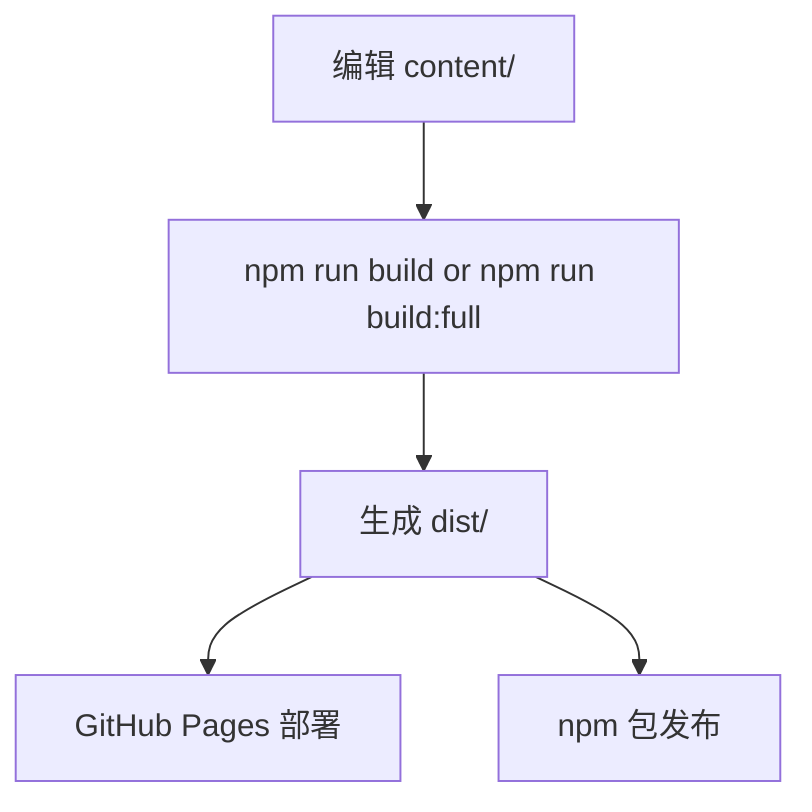

# Build And Publish Relationship

这里最容易混淆的是 `content/`、`dist/`、GitHub Pages 和 npm publish 之间的关系。

可以直接按“原材料”和“成品”来理解：

- `content/` 是原材料
- `dist/` 是构建后的成品

也就是说：

`content/` 负责保存你维护的原始简历数据，例如 YAML 和项目 Markdown。

`scripts/build.mjs` 会读取这些内容，生成最终给外部消费的产物，例如：

- `dist/resume.json`
- `dist/index.html`
- `dist/print/index.html`
- `dist/resume.md`
- `dist/resume.txt`
- `dist/resume.7`
- `dist/resume.pdf`

流程图如下：

## What Gets Published To GitHub Pages

推送到 `main` 分支后，GitHub Actions 会执行部署流程，并把 `dist/` 上传到 GitHub Pages。

所以网站展示的数据，本质上来自 `content/`，但真正被部署的是构建后的 `dist/`。

## What Gets Published To npm

npm 不会自动发布整个仓库，而是只会发布 `package.json` 里 `files` 字段允许包含的内容。

当前配置会发布：

- `README.md`
- `bin/`
- `dist/`
- `renderers/cli/`

当前配置不会发布：

- `content/`
- `scripts/`
- `tests/`

这意味着 npm 用户安装包后，拿到的是已经构建好的结果，例如 `dist/resume.json` 和 `dist/resume.md`，而不是 `content/` 里的原始 YAML。

## Answering The Common Question Directly

“npm 上的数据是不是 `content` 的数据？”

更准确的回答是：

- 数据来源是 `content/`
- 发布出去的是由 `content/` 构建出来的 `dist/`

所以它不是“直接把 `content/` 原样发到 npm”，而是“把 `content/` 加工后的结果发到 npm”。

## Deployment And Release Are Separate

这个仓库当前有两条独立流程：

1. 推送 `main`
2. 推送 `v*` tag

含义分别是：

1. 推送 `main` 会触发 GitHub Pages 部署
2. 推送 `v*` tag 才会触发 npm 发布

因此：

- 普通 `git push` 不会自动发布 npm
- npm 版本号也不会因为 push 自动增加
- 只有你先更新版本号，再推送对应 tag，才会发布新版本到 npm
