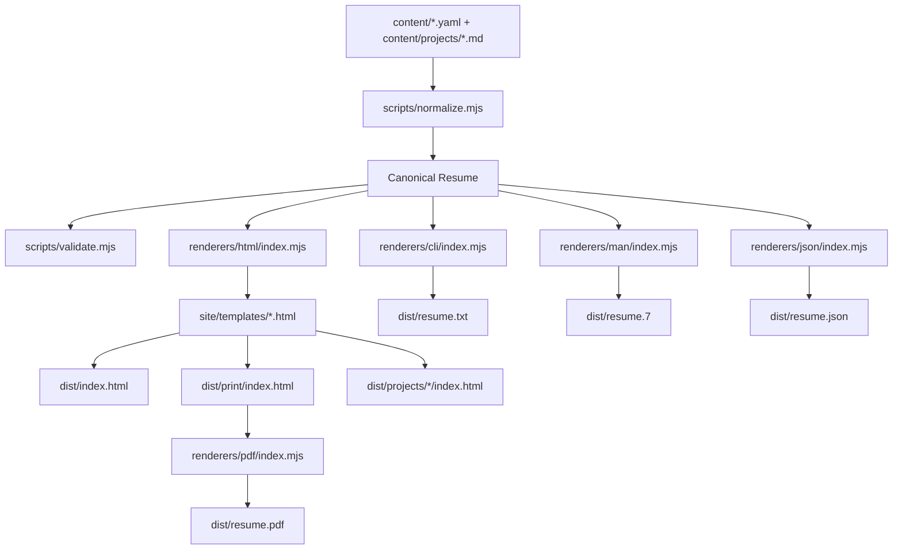
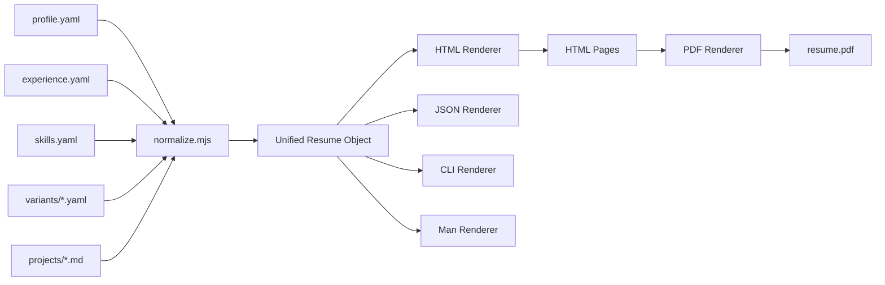
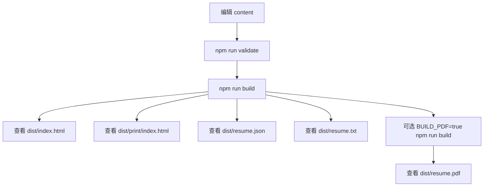

# Architecture And Flow

这个项目是一个“单一内容源简历生成器”。

你维护 `content/` 里的简历内容，构建脚本会把这些内容整理成统一的数据结构，再渲染成多个渠道的输出，包括 HTML、PDF、CLI、man page 和 JSON。

## Overall Architecture

## Core Flow

整个流程可以拆成 4 层：

1. 内容层
2. 规范化层
3. 渲染层
4. 构建产物层

### 1. 内容层

原始内容都在 `content/`：

- `content/profile.yaml`
- `content/experience.yaml`
- `content/skills.yaml`
- `content/variants/*.yaml`
- `content/projects/*.md`

这些文件只负责表达简历数据，不负责页面结构。

### 2. 规范化层

[scripts/normalize.mjs](/Users/zzh/Documents/code/resume/scripts/normalize.mjs) 负责：

- 读取 `content/` 的 YAML 和 Markdown
- 解析项目 frontmatter
- 根据 `variant` 应用标题、摘要和排序规则
- 组装成统一的 `resume` 数据对象

这个统一对象是整个项目的核心中间层。后续所有渲染器都依赖它，而不是各自去读 `content/`。

### 3. 渲染层

不同格式各有一个 renderer：

- [renderers/html/index.mjs](/Users/zzh/Documents/code/resume/renderers/html/index.mjs)
- [renderers/json/index.mjs](/Users/zzh/Documents/code/resume/renderers/json/index.mjs)
- [renderers/cli/index.mjs](/Users/zzh/Documents/code/resume/renderers/cli/index.mjs)
- [renderers/man/index.mjs](/Users/zzh/Documents/code/resume/renderers/man/index.mjs)
- [renderers/pdf/index.mjs](/Users/zzh/Documents/code/resume/renderers/pdf/index.mjs)

其中 HTML 渲染依赖模板文件：

- [site/templates/layout.html](/Users/zzh/Documents/code/resume/site/templates/layout.html)
- [site/templates/home.html](/Users/zzh/Documents/code/resume/site/templates/home.html)
- [site/templates/print.html](/Users/zzh/Documents/code/resume/site/templates/print.html)
- [site/templates/project.html](/Users/zzh/Documents/code/resume/site/templates/project.html)

这里要区分两件事：

- HTML 展示的数据内容，主要来自 `content/`
- HTML 的布局、区块标题、样式和模块结构，来自 renderer 和 template

也就是说，当前架构是：

`content` 决定“展示什么”

`renderers + templates` 决定“怎么展示”

### 4. 构建产物层

[scripts/build.mjs](/Users/zzh/Documents/code/resume/scripts/build.mjs) 是统一构建入口，负责：

- 先执行校验
- 清空并重建 `dist/`
- 生成 JSON、HTML、CLI、man page
- 写入 `CNAME` 和 `.nojekyll`
- 在 `BUILD_PDF=true` 时生成 PDF

最终产物输出到 `dist/`。

## Data Flow

## Directory Responsibilities

- [content](/Users/zzh/Documents/code/resume/content)
  原始内容源

- [scripts/normalize.mjs](/Users/zzh/Documents/code/resume/scripts/normalize.mjs)
  读取内容并生成统一数据结构

- [scripts/validate.mjs](/Users/zzh/Documents/code/resume/scripts/validate.mjs)
  校验内容完整性和合法性

- [scripts/build.mjs](/Users/zzh/Documents/code/resume/scripts/build.mjs)
  统一构建入口

- [renderers](/Users/zzh/Documents/code/resume/renderers)
  多种输出格式的渲染器

- [site/templates](/Users/zzh/Documents/code/resume/site/templates)
  HTML 模板和样式骨架

- [dist](/Users/zzh/Documents/code/resume/dist)
  最终生成产物

- [tests](/Users/zzh/Documents/code/resume/tests)
  规范化和 HTML 渲染测试

## Variant Mechanism

`variant` 是这个项目里比较重要的一层配置能力。

它目前主要控制：

- `headline` 覆盖
- `summary` 覆盖
- 工作经历排序
- 技能排序
- 首页项目排序

也就是说，当前已经做到“同一份内容源，可以根据不同用途生成不同版本的简历”。

但当前还没有做到：

- 页面结构完全配置化
- 所有区块标题都下沉到内容配置
- 主题 token 完全配置化

所以当前更准确的描述是：

- 内容是单一来源
- 展示层是模板驱动
- variant 只控制部分展示策略

## Daily Workflow

平时改内容和预览的流程如下：

## Typical Change Entry Points

如果你之后要改项目，入口通常是：

- 想改文案、项目、技能、经历
  改 `content/`

- 想改 variant 的顺序或定向文案
  改 `content/variants/*.yaml`

- 想改 HTML 结构和页面模块
  改 [renderers/html/index.mjs](/Users/zzh/Documents/code/resume/renderers/html/index.mjs) 和 [site/templates](/Users/zzh/Documents/code/resume/site/templates)

- 想改构建流程
  改 [scripts/build.mjs](/Users/zzh/Documents/code/resume/scripts/build.mjs)

- 想改数据整理逻辑
  改 [scripts/normalize.mjs](/Users/zzh/Documents/code/resume/scripts/normalize.mjs)

## Summary

这套架构的核心价值是：

- 内容维护集中在 `content/`
- 一次维护，多处输出
- HTML、PDF、CLI、JSON 共用一套统一数据结构
- variant 可以在不复制内容的前提下产出不同版本

当前最值得记住的一句话是：

> `content` 是简历内容源，`normalize` 是统一数据层，`renderers` 是多渠道输出层，`build` 是总装配入口。
